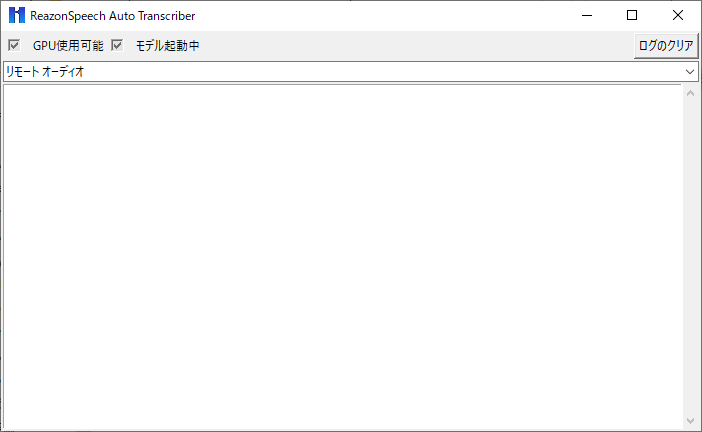

# ReazonSpeechAutoTranscriber

ReazonSpeech(Reazon Human Interaction Laboratory)を利用した自動文字起こしツールです。CUDAが使用できる場合はGPUでの動作も可能です。

GPU搭載PCの場合は6GB程度のメモリがあれば動作しますが、そうではない場合はクラッシュするかもしれません(いつか修正します)。

## インストール方法

[Release](https://github.com/Kotetsu0000/ReazonSpeechAutoTranscriber/releases)からReazonSpeechAutoTranscriber.7zをダウンロードして、解凍してください。

## 実行方法

解凍したフォルダ内にあるReazonSpeechAutoTranscriber.exeを実行する。

## 実行環境

Windows10, GPU推論を行いたい場合はCUDAが動作するNVIDIA GPU(GTX 1000番以降のものならいけるはず)

## 実行画面

# License

The source code is licensed under the Apache License, Version2.0, see LICENSE.
